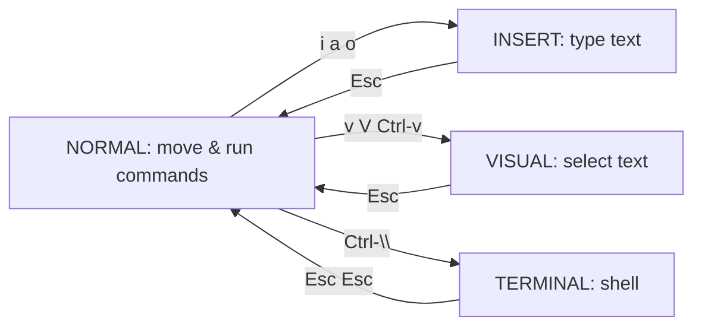

# 01 — Getting started

[← Back to index](README.md) · Next: [Cheat sheet →](02-cheatsheet.md)

This page gets you from "the editor just opened" to "I can move, edit, save, and
ask for help" without panicking.

## Opening and closing

After running `./setup.sh`, open a new terminal so the `vim` alias is active.

```bash
vim                # open the dashboard
vim file.py        # open a file
vim .              # open the current directory in the file explorer
```

To quit (from **normal mode** — see below):

| Keys | Action |
|------|--------|
| `<leader>w` | Save (`:w`) |
| `<leader>q` | Close this window (`:q`) |
| `:wq` or `ZZ` | Save and quit |
| `:q!` or `ZQ` | Quit without saving |
| `<leader>Q` | Quit everything |

> `<leader>` is the **Space** bar. So `<leader>w` means "press Space, then w".

If you ever get stuck in a weird state, press `<Esc>` a couple of times to get
back to normal mode.

## The four modes

Vim is *modal*: the same keys do different things depending on the mode. This is
the whole secret of its speed.



| Mode | You are here to… | Enter it with | Leave with |
|------|------------------|---------------|------------|
| **Normal** | Move around, run commands (the home base) | `<Esc>` | — |
| **Insert** | Type text like a normal editor | `i` `a` `o` | `<Esc>` |
| **Visual** | Select text | `v` (char) `V` (line) `<C-v>` (block) | `<Esc>` |
| **Terminal** | Use a shell inside nvim | `<C-\>` | `<Esc><Esc>` |

**The mindset:** you spend most of your time in *normal* mode, dipping into
insert mode only to type, then popping back out with `<Esc>`. The current mode is
shown on the left of the statusline at the bottom.

### Ways to enter insert mode (they matter)

| Key | Where you start typing |
|-----|------------------------|
| `i` | before the cursor |
| `a` | after the cursor |
| `I` | at the first non-blank of the line |
| `A` | at the end of the line |
| `o` | a new line below |
| `O` | a new line above |
| `ciw` | replace the word under the cursor |

## Reading the line numbers (hybrid)

This setup shows **hybrid** line numbers:

```
 12  def process(data):
 11      result = []
 10      for row in data:
  9          if row.valid:
500          result.append(row)   <- cursor is on this line (absolute 500)
  1          log(row)
  2      return result
```

- The line you're on shows its **absolute** number (e.g. `500`).
- Every other line shows how far it is from you (**relative**).

Why this rules: to jump down 10 lines you just read the `10` next to the target
and type `10j`. To delete the next 3 lines: `3dd`. To yank 5 lines up: `5yk`. No
counting, no mouse.

| Keys | Action |
|------|--------|
| `10j` | down 10 lines |
| `8k` | up 8 lines |
| `5dd` | delete 5 lines |
| `:500` or `500G` | jump to absolute line 500 |
| `gg` / `G` | top / bottom of file |

## Asking the editor for help (so you never memorize)

This is the most important habit in this whole setup:

- **Press `<Space>` and pause.** A menu (which-key) lists every leader shortcut,
  grouped by topic (find, code, git, …). Keep pressing keys to drill in.
- `<leader>fk` — fuzzy-search **all keymaps**.
- `<leader>fh` — search the built-in **help** (`:help`).
- `:help <topic>` — Vim's manual, e.g. `:help text-objects`.
- `K` — hover docs for the symbol under the cursor (in code).

## Your first 10 minutes

1. Open a file: `vim ~/.bashrc` (or any file).
2. Move with `h j k l` (left/down/up/right). Resist the arrow keys.
3. Jump a few lines using the relative numbers: `5j`, `3k`.
4. Enter insert mode with `i`, type something, press `<Esc>`.
5. Undo with `u`, redo with `<C-r>`.
6. Save with `<leader>w`.
7. Press `<Space>` and explore the menu.
8. Quit with `<leader>q`.

When that feels OK, go to the [cheat sheet](02-cheatsheet.md) and start
[the drills](10-practice-drills.md).
